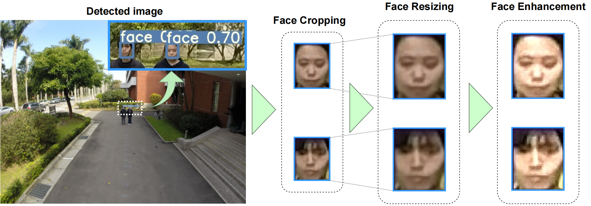

# MobiLocal
MobiLocal is a target recognition system designed for unmanned aerial vehicles (UAVs), based on YOLOv7 and Face++. This system employs YOLOv7 initially to detect and extract faces, followed by a Recalibration process to further enhance the faces (including resizing and facial enhancement). Subsequently, the processed data is input into Face++ for facial recognition. We trained YOLOv7 using the WiderFace dataset and conducted testing using DroneFace and NJlocalFace datasets. In scenarios with lower angles and shorter distances, the system achieves an average accuracy rate exceeding 90%, demonstrating its excellent performance.

## YOLOv7
YOLOv7 is a powerful object detection system. We trained YOLOv7 using the WiderFace dataset to enable it to specifically detect faces. In YOLOv7, the `detect_auto_save.py` script was developed based on the `detect.py` script, adding the functionality to automatically extract and save faces.

We compared the trained YOLOv7 with Dlib and OpenCV (using the haarcascade_frontalface_default.xml) and found that YOLOv7 performs extremely well.

To utilize YOLOv7, you can place the images to be detected in the `YOLOv7/inference` directory, and then run detect_auto_save.py (or detect.py). The results can be found in `YOLOv7/runs/detect` directory.

For reference, the original text can be cited as follows: [YOLOv7](https://github.com/WongKinYiu/yolov7 "YOLOv7")
## Recalibration
The Recalibration stage consists of two steps: size adjustment and facial enhancement. 

For Face++ to process images, it requires a minimum pixel size of 48x48 and a maximum of 4096x4096. Therefore, it is necessary to resize small face images that do not meet these criteria (typically, large face images do not occur). We proportionally enlarge the image while maintaining its aspect ratio, so that the minimum value of its width and height reaches 200. This size is chosen because the subsequent enhancement performed with the Laplacian operator can effectively improve the accuracy of facial recognition.

The purpose of facial enhancement is to enhance the features of blurred faces. Laplacian enhancement is a commonly used image processing technique. By applying the Laplacian operator, we can effectively highlight the details of small facial images, thereby improving the accuracy and performance of face detection and recognition.

## Face++
Face++ has a wide range of features and advantages such as high speed and accuracy. We compared Face++ with ArcFace and Facenet, and from the results, it can be seen that Face++ has advantages in terms of high recognition rate and strong robustness, performing well.
 |  | 
---|---|---

To use Face++, you need to register your account on its [official website](https://www.faceplusplus.com.cn/) to obtain the `key` and `secret`, which need to be included in any Face++ code to confirm your identity and use the features of Face++.

The steps are as follows:
1. Create FaceSet: modify the `outer_id` (required) and `display_name`, where the former is the identifier of the FaceSet and the latter is the alias of the FaceSet. Run **CreateFaceSet.py** to obtain your own FaceSet.
2. Face detection and obtaining face_token: modify the `filepath` in **FaceDetection.py**, then run it and record the face_token in the results.
3. Add faces: modify the `outer_id` and `face_tokens` in **AddFaces.py**, then run it to add faces.
4. Add tags: modify the `face_token` and `user_id` in **AddTag.py**, then run it to add tags to faces.
5. Face search: modify the `outer_id` and `folder_path` in **FaceSearch.py**, then run it to output the search results.

Please refer to the [Face++ technical manual](https://console.faceplusplus.com.cn/documents/268763412) for more details.
## Dataset
The NJlocalFace dataset is located in the NJlocalFace folder of this project. Please click the links below to download the other two datasets:

[Download WiderFace:](http://shuoyang1213.me/WIDERFACE/) 

[Download DroneFace:](https://hjhsu.github.io/DroneFace/) 
